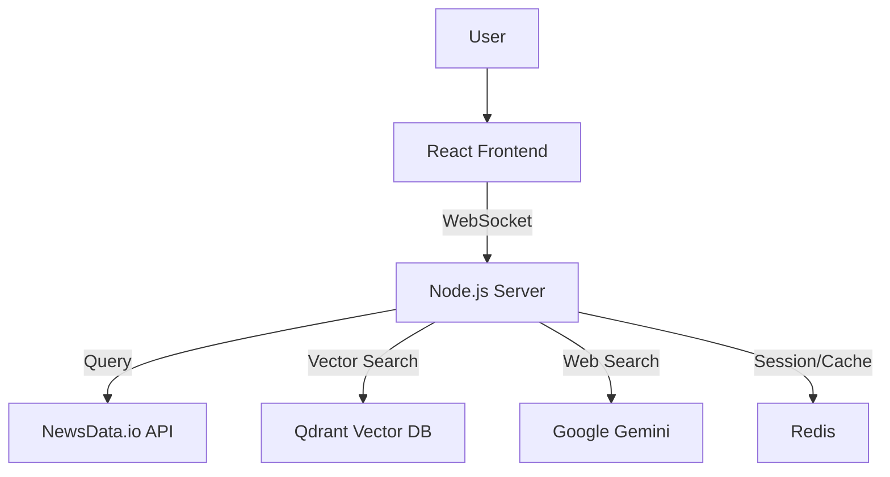

# RAG-Powered News Chatbot: System Architecture

## System Overview

The RAG-Powered News Chatbot is a real-time news query system that combines multiple data sources and AI technologies to provide accurate, up-to-date responses to user queries about news events.



## 1. Data Flow & Processing

### 1.1 News Data Processing

The system uses a three-tier approach for news retrieval:

1. **Real-time News (Primary)**
   - Uses NewsData.io API for current news
   - Direct semantic search through API
   - No embedding required for this tier

2. **Historical News (Secondary)**
   - Stored in Qdrant vector database
   - Embeddings created using Xenova/all-MiniLM-L6-v2
   - Normalized and cached for performance

3. **Web Search (Fallback)**
   - Uses Gemini model for general web search
   - Activated when no relevant news found

### 1.2 Embedding Pipeline

```javascript
async function generateEmbedding(text) {
  // Cache check
  const cacheKey = text.slice(0, 100);
  if (embeddingCache.has(cacheKey)) {
    return embeddingCache.get(cacheKey);
  }

  // Generate embedding
  const embedder = await getEmbedder();
  const output = await embedder(text, {
    pooling: 'mean',
    normalize: true
  });
  
  // Cache management
  embeddingCache.set(cacheKey, embedding);
  if (embeddingCache.size > 1000) {
    const firstKey = embeddingCache.keys().next().value;
    embeddingCache.delete(firstKey);
  }
}
```

## 2. Caching & Session Management

### 2.1 Redis Implementation

- **Session Storage**
  - TTL: 24 hours (configurable)
  - Stores: Chat history, user context
  - Key format: `chat:{sessionId}`

- **Caching Strategy**
  ```javascript
  // Store message
  await redisClient.lpush(`chat:${sessionId}`, JSON.stringify({
    role: 'user',
    content: message,
    timestamp: new Date().toISOString()
  }));

  // Set TTL
  await redisClient.expire(`chat:${sessionId}`, REDIS_TTL);
  ```

### 2.2 Session Management

- Sessions identified by UUID
- Persistent across page reloads
- Stored in localStorage and Redis
- Automatic cleanup after TTL expiration

## 3. Frontend Architecture

### 3.1 WebSocket Communication

```javascript
// Socket initialization
const socket = io(SOCKET_URL, {
  query: { sessionId: currentSessionId },
  transports: ['websocket', 'polling'],
  timeout: 60000
});

// Event handling
socket.on('message', (message) => {
  if (message.isComplete) {
    setStreamedMessage(null);
    setMessages((prev) => [...prev, message]);
  }
});

socket.on('status', (status) => {
  setStatus(status);
});
```

### 3.2 State Management

- Real-time status updates
- Three status types:
  1. `idle`: Ready for input
  2. `typing`: Processing query
  3. `processing`: Generating response

### 3.3 Error Handling

```javascript
socket.on('error', (error) => {
  console.error('Socket error:', error);
  setError('An error occurred...');
  setStatus({ type: 'idle' });
  // Show error message in chat
  setMessages((prev) => [...prev, {
    role: 'assistant',
    content: 'Sorry, there was an error...',
    isError: true
  }]);
});
```

## 4. Notable Design Decisions

### 4.1 Multi-tier Search Strategy

1. **NewsData.io First**
   - Provides most recent news
   - Direct semantic search
   - Fastest response time

2. **Vector Search Second**
   - Historical context
   - Locally stored data
   - More control over content

3. **Web Search Last**
   - Broadest coverage
   - Slower but comprehensive
   - Handles edge cases

### 4.2 Asynchronous Operations

- Non-blocking Redis operations
- Background caching
- Progressive loading indicators

```javascript
// Non-blocking operations
const [storeMessage, setTTL] = await Promise.all([
  redisClient.lpush(...),
  redisClient.expire(...)
]);
```

### 4.3 User Experience

- Immediate feedback
- Typing indicators
- Status messages
- Error recovery options

## 5. Potential Improvements

1. **Performance**
   - Implement embedding pre-computation
   - Add Redis caching for embeddings
   - Optimize vector search parameters

2. **Scalability**
   - Add load balancing
   - Implement horizontal scaling
   - Shard vector database

3. **Features**
   - Add source attribution
   - Implement fact-checking
   - Add multi-language support

4. **Reliability**
   - Add circuit breakers
   - Implement retry mechanisms
   - Add monitoring and alerts

## 6. Security Considerations

1. **Data Protection**
   - Session encryption
   - API key rotation
   - Rate limiting

2. **Input Validation**
   - Query sanitization
   - Length limits
   - Content filtering

3. **Error Handling**
   - Graceful degradation
   - User-friendly errors
   - Logging and monitoring

## 7. Monitoring & Maintenance

1. **Performance Metrics**
   - Response times
   - Cache hit rates
   - Error rates

2. **Health Checks**
   - Service availability
   - Database connectivity
   - API status

3. **Logging**
   - Error tracking
   - User interactions
   - System events 